# 打印管理器|../common/dde_printer_96.svg|

## 概述

打印管理器是一款基於CUPS的打印機管理工具，可同時管理多個打印機。界面可視化，操作簡單，方便用戶快速添加打印機及安裝驅動。

## 使用入門

您可以通過以下方式運行或關閉打印管理器，或者創建快捷方式。

### 運行打印管理器

1. 單擊任務欄上的啟動器圖標 ，進入啟動器界面。

2. 上下滾動鼠標滾輪瀏覽或通過搜索，找到打印管理器圖標 ，單擊運行。

3. 右鍵單擊 ，您可以：
   - 單擊 **傳送到桌面**，在桌面創建快捷方式。
   - 單擊 **傳送到任務欄**，將應用程序固定到任務欄。
   - 單擊 **加至開機啟動**，將應用程序添加到開機啟動項，在電腦開機時自動運行該應用程序。

### 關閉打印管理器

- 在打印管理器界面單擊   ，退出打印管理器。
- 右鍵單擊任務欄上的 ，選擇 **關閉所有** 來退出打印管理器。
- 在打印管理器界面單擊 ，選擇 **退出** 來退出打印管理器。

## 添加打印機

### 網絡連接打印機

#### 查找打印機

在打印管理器界面，單擊，可選擇 **自動查找**、**手動查找**、**URI查找**，添加打印機。

**自動查找**

1. 單擊 **自動查找** 按鈕，會加載出打印機列表，選擇需要添加的打印機。

2. 選好打印機後，會加載出驅動列表，默認選擇推薦打印機驅動。若選擇手動驅動方案，則會跳轉到手動選擇打印機驅動界面。

&nbsp;&nbsp;&nbsp;&nbsp;&nbsp;&nbsp;&nbsp;&nbsp;&nbsp;&nbsp;&nbsp;&nbsp;&nbsp;
3. 單擊 **安裝驅動**，進入安裝界面。

**手動查找**

1. 單擊 **手動查找** 按鈕，輸入打印機IP後單擊 **查找** 按鈕，系統通過各種協議掃描打印機。

&nbsp;&nbsp;&nbsp;&nbsp;&nbsp;&nbsp;&nbsp;&nbsp;&nbsp;&nbsp;&nbsp;&nbsp;&nbsp;
2. 選好打印機後，會加載出驅動列表，默認選擇推薦打印機驅動。若沒有加載出驅動列表，則選擇手動驅動方案。

3. 單擊 **安裝驅動**，進入安裝界面。

**URI查找**

1. 在 **自動查找** 和 **手動查找** 的情況下都不能查詢到打印機時，可通過URI查找並安裝打印驅動。

2. 單擊 **URI查找** 按鈕，輸入打印機的URI。

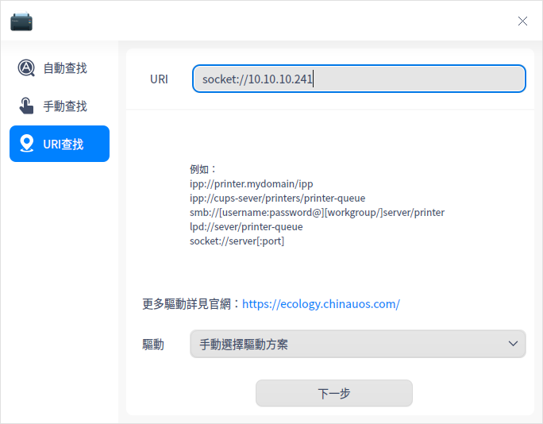
&nbsp;&nbsp;&nbsp;&nbsp;&nbsp;&nbsp;&nbsp;&nbsp;&nbsp;&nbsp;&nbsp;&nbsp;&nbsp;
3. 系統默認選擇手動驅動方案安裝，單擊 **下一步**，進入選擇驅動界面。

4. 用戶選擇對應的驅動，單擊 **安裝驅動**，進入安裝界面。

#### 選擇驅動

1. 系統默認驅動：選擇打印機後，如果有匹配的驅動，系統會默認選擇推薦驅動。

2. 手動選擇驅動：選擇打印機後，選擇手動選擇驅動，驅動來源有三種。

 - 本地驅動：通過下拉框選擇廠商及型號，查詢本地驅動。

   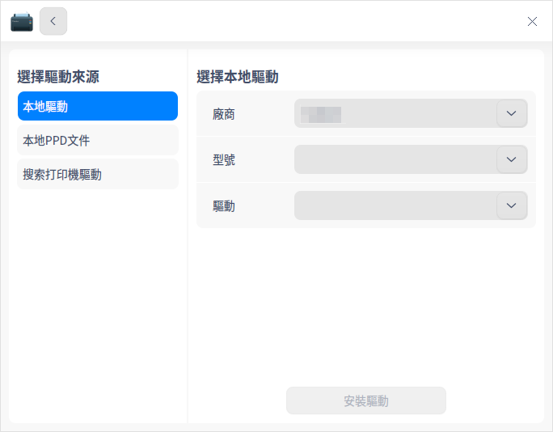
 &nbsp;&nbsp;&nbsp;&nbsp;&nbsp;&nbsp;&nbsp;&nbsp;&nbsp;&nbsp;&nbsp;&nbsp;&nbsp;
  
 - 本地PPD文件：將本地文件PPD文件拖放到對應地方，或單擊 **選擇一個PPD文件** 在本地文件夾查找，比如在/usr/share/ppd目錄下選擇ppd文件。

   >  說明：必須在本地安裝了驅動才可使用PPD文件安裝，否則會提示驅動安裝失敗。

   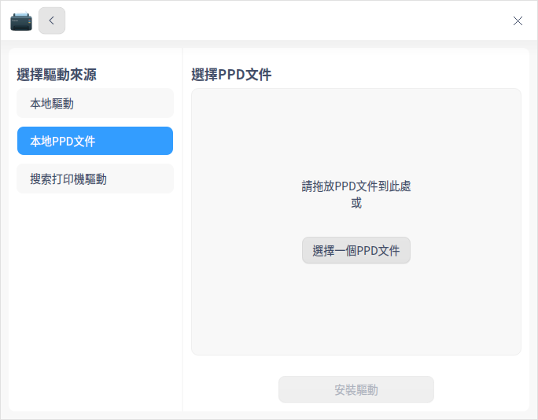
&nbsp;&nbsp;&nbsp;&nbsp;&nbsp;&nbsp;&nbsp;&nbsp;&nbsp;&nbsp;&nbsp;&nbsp;&nbsp;
  
 - 搜索打印機驅動：輸入精確的廠商和型號，系統會在後台驅動庫中探測搜索，搜索結果會顯示在下拉框中。

   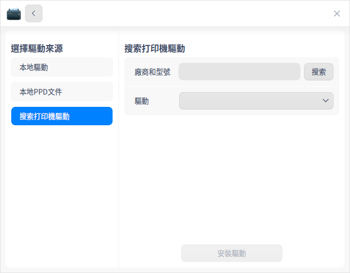

#### 安裝打印機

選擇驅動後，單擊 **開始安裝**，進入安裝界面。

 - 安裝成功：彈出窗口提示安裝成功，可以單擊 **打印測試頁**，查看是否可以正常打印；或單擊 **查看打印機**，跳轉到打印機管理界面。

   
   &nbsp;&nbsp;&nbsp;&nbsp;&nbsp;&nbsp;&nbsp;&nbsp;&nbsp;&nbsp;&nbsp;&nbsp;&nbsp;

 - 安裝失敗：彈出窗口提示安裝失敗，則可選擇重新安裝。

   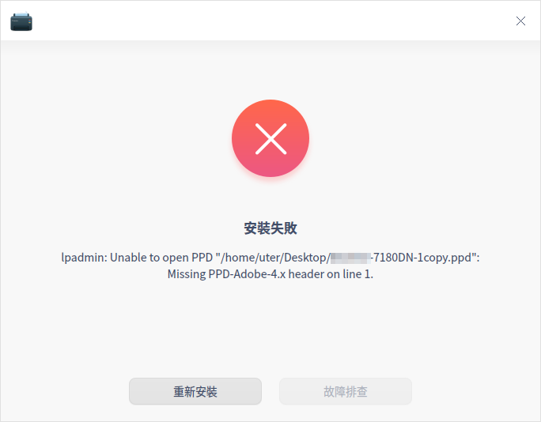

### USB直連打印機

當打印機設備通過USB連接電腦時，打印管理器會自動添加該打印機設備，您可以根據配置結果進行相關操作。

> 說明：只有適配過的打印機，後台能夠查詢到驅動，才可能自動添加成功。

- 配置成功：彈出配置成功的通知，單擊後跳轉到打印管理器界面，可查看打印機詳情。

  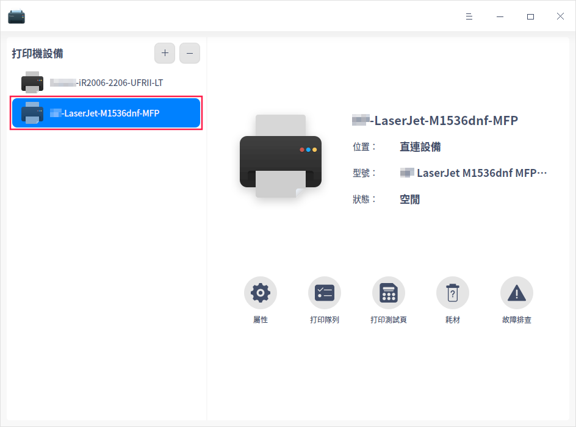

- 配置失敗：彈出配置失敗的通知，單擊後跳轉到打印管理器界面，您可以選擇手動添加驅動，詳細操作請參考 [網絡連接打印機](#網絡連接打印機)。

## 打印管理界面

若已經成功添加了打印機，可在打印管理器界面查看詳情。選中打印機，可選擇屬性設置、打印隊列、打印測試頁、查看耗材及故障排查。

### 打印屬性 

1. 在打印管理器主界面單擊 **屬性**，跳轉到打印屬性設置列表界面。

2. 您可以查看打印機驅動、URI、位置、描述、顏色及解像度等。

3. 您還可以設置項紙張來源、紙張類型、紙張大小、雙面打印、頁邊距位置、方向、打印順序等。可根據您的實際需求進行設置，如紙張大小可以選擇A4、A5、B5或A3等，打印方向可以選擇縱向、橫向或反橫向等。

>  說明：打印機屬性列表與打印機型號及驅動相關聯，請以實際情況為準。

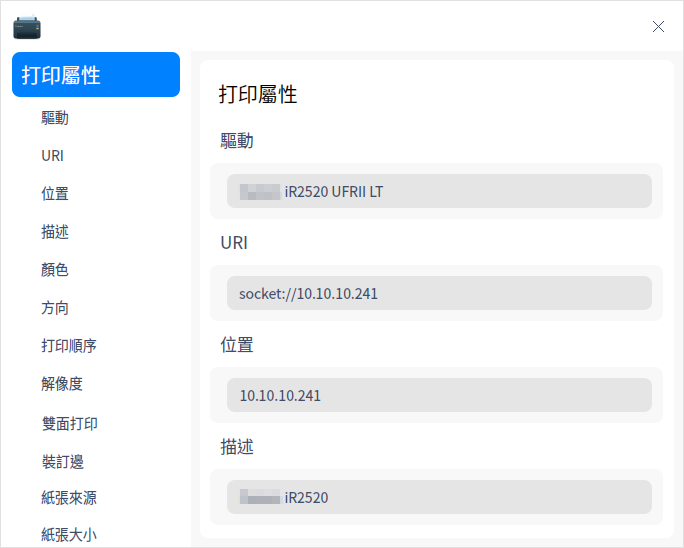

### 打印隊列

1. 在打印管理器主界面單擊 **打印隊列**，進入主界面，可選擇全部列表、打印隊列、已完成列表和刷新列表操作。系統默認選擇 **打印隊列** 界面。

2. 界面列表內容為：任務ID、用戶、文檔名稱、打印機、大小、提交時間、狀態及操作。

3. 選擇一個打印任務後，右鍵可進行 **取消打印**、**刪除任務**、**暫停打印**、**恢復打印**、**優先打印**、**重新打印** 操作。

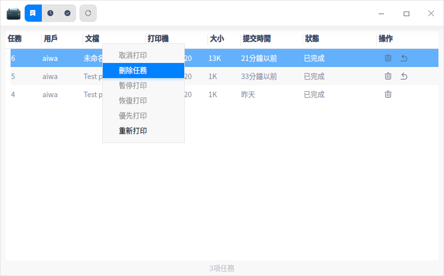

### 打印測試頁

在打印管理器主界面，單擊 **打印測試頁**，測試是否打印成功。

  - 打印成功：測試頁打印成功，可進行其他的打印任務。

  - 打印失敗：測試頁打印失敗，選擇重新安裝或故障排查。

### 耗材

在打印管理器主界面，單擊 **耗材** 可查看打印機耗材餘量，如果餘量不足，則需要更換。

### 故障排查

打印失敗時，在打印管理器主界面可單擊 **故障排查**，排查內容如下：

&nbsp;&nbsp;&nbsp;&nbsp;&nbsp;&nbsp;&nbsp;&nbsp;&nbsp;&nbsp;&nbsp;&nbsp;&nbsp;

  - 檢查cups服務是否開啟。

  - 檢查驅動文件是否完整。

  - 檢查打印機設置：打印機是否啟動、是否接受任務。

  - 檢查打印機連接狀態是否正常。

### 右鍵菜單

在打印管理器主界面，選中打印機型號，單擊右鍵，可設置打印機是否共享、是否啟動、是否接受任務、是否設為默認打印機。

> 說明：共享打印機前必須開啟  “主菜單 > 設置” 頁面中的共享功能，否則即使在右鍵菜單中勾選了也不會生效。

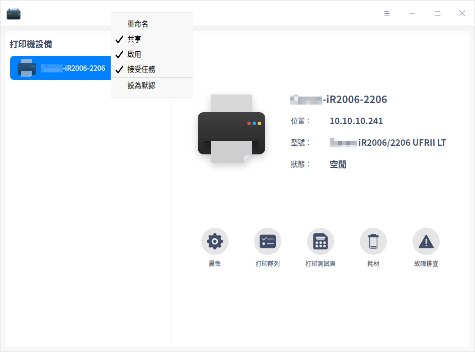

## 刪除打印機

在打印管理器主界面，單擊，可刪除選中的打印機。

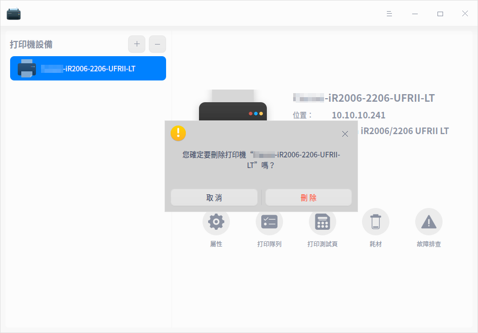

## 主菜單

在主菜單中，您可以進行基本伺服器設置，切換窗口主題，查看幫助手冊等操作。

### 設置

1. 在打印管理器主界面，單擊 。

2. 單擊 **設置**，可以進行基本伺服器設置。

   - 是否發佈連接到這個系統的共享打印機，開啟後可以共享已添加的打印機，同一局域網的用戶才能進行連接。
   - 是否允許遠程管理打印機。
   - 是否保留調試訊息用於故障排除。

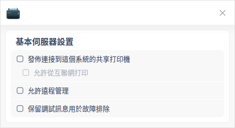

### 主題

窗口主題包含淺色主題、深色主題和跟隨系統主題。

1. 在打印管理器主界面，單擊 。
2. 單擊 **主題**，選擇一個主題顏色。

### 幫助

1. 在打印管理器主界面，單擊 。
2. 單擊 **幫助**，查看幫助手冊，進一步了解和使用打印管理器。

### 關於

1. 在打印管理器主界面，單擊 。
2. 單擊 **關於**，查看打印管理器的版本和介紹。

### 退出

1. 在打印管理器主界面，單擊 。
2. 單擊 **退出**。